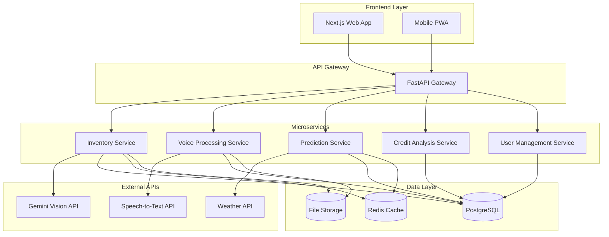

# Design Document: VyapaarNiti

## Overview

VyapaarNiti is an AI-powered inventory and credit intelligence system specifically designed for Indian Kirana stores. The system leverages modern web technologies, computer vision, and machine learning to provide comprehensive business intelligence through photo-based inventory counting, voice transaction logging, demand prediction, and credit analysis.

The architecture follows a microservices pattern with a Next.js frontend and Python FastAPI backend, integrating with Google's Gemini Vision API for computer vision capabilities. The system is designed to handle the unique challenges of Indian retail markets, including festival-driven demand patterns, multilingual support, and varying internet connectivity.

## Architecture

### High-Level Architecture



### Technology Stack

**Frontend:**
- Next.js 14 with TypeScript for web application
- Tailwind CSS for responsive design
- PWA capabilities for mobile optimization
- React Hook Form for form management
- Zustand for state management

**Backend:**
- Python 3.11+ with FastAPI framework
- Pydantic for data validation
- SQLAlchemy for ORM
- Alembic for database migrations
- Celery for background task processing
- Redis for caching and task queue

**External Integrations:**
- Google Gemini Vision API for image processing
- OpenWeatherMap API for weather data
- Google Speech-to-Text API for voice processing
- Indian festival calendar API

**Infrastructure:**
- PostgreSQL for primary data storage
- Redis for caching and session management
- AWS S3/Google Cloud Storage for file storage
- Docker for containerization

## Components and Interfaces

### 1. Inventory Management Service

**Responsibilities:**
- Process shelf photos using computer vision
- Maintain product catalog and inventory levels
- Handle inventory updates from various sources
- Generate inventory reports and alerts

**Key Interfaces:**
```python
class InventoryService:
    async def process_shelf_photo(self, photo: UploadFile, store_id: str) -> InventoryCount
    async def update_inventory(self, store_id: str, updates: List[InventoryUpdate]) -> bool
    async def get_current_inventory(self, store_id: str) -> List[InventoryItem]
    async def get_low_stock_alerts(self, store_id: str) -> List[StockAlert]
```

**Computer Vision Integration:**
- Utilizes Gemini Vision API with custom prompts for Indian retail products
- Implements confidence scoring for uncertain counts
- Supports multiple product categories common in Kirana stores
- Handles varying lighting conditions and shelf arrangements

### 2. Voice Processing Service

**Responsibilities:**
- Convert voice notes to text using speech recognition
- Extract transaction data from transcribed text
- Support Hindi and English language processing
- Handle audio quality variations

**Key Interfaces:**
```python
class VoiceProcessingService:
    async def transcribe_voice_note(self, audio: UploadFile) -> TranscriptionResult
    async def extract_transaction_data(self, transcription: str) -> TransactionData
    async def process_voice_transaction(self, audio: UploadFile, store_id: str) -> Transaction
```

**Natural Language Processing:**
- Custom NLP models trained on Indian retail terminology
- Support for code-mixing (Hindi-English)
- Product name recognition and standardization
- Quantity and price extraction algorithms

### 3. Demand Prediction Service

**Responsibilities:**
- Analyze historical sales and inventory data
- Incorporate weather and festival information
- Generate demand forecasts and recommendations
- Provide actionable insights for inventory planning

**Key Interfaces:**
```python
class DemandPredictionService:
    async def generate_demand_forecast(self, store_id: str, days_ahead: int) -> DemandForecast
    async def get_festival_impact_analysis(self, store_id: str, festival: str) -> FestivalImpact
    async def generate_stocking_recommendations(self, store_id: str) -> List[StockingRecommendation]
    async def analyze_seasonal_patterns(self, store_id: str) -> SeasonalAnalysis
```

**Machine Learning Pipeline:**
- Time series forecasting using Prophet or similar algorithms
- Feature engineering incorporating weather, festivals, and historical patterns
- Model retraining based on new transaction data
- A/B testing framework for recommendation effectiveness

### 4. Credit Analysis Service

**Responsibilities:**
- Analyze cash flow patterns from transaction data
- Calculate creditworthiness scores
- Generate financial health reports
- Identify trends and anomalies in business performance

**Key Interfaces:**
```python
class CreditAnalysisService:
    async def analyze_cash_flow(self, store_id: str, period: DateRange) -> CashFlowAnalysis
    async def calculate_credit_score(self, store_id: str) -> CreditScore
    async def generate_financial_report(self, store_id: str) -> FinancialReport
    async def detect_financial_anomalies(self, store_id: str) -> List[FinancialAnomaly]
```

**Financial Analysis Algorithms:**
- Revenue trend analysis with seasonal adjustments
- Expense pattern recognition and categorization
- Inventory turnover calculations
- Profit margin analysis and benchmarking

### 5. User Management Service

**Responsibilities:**
- Handle user authentication and authorization
- Manage store profiles and settings
- Support multi-language preferences
- Handle user onboarding and tutorials

**Key Interfaces:**
```python
class UserManagementService:
    async def authenticate_user(self, credentials: UserCredentials) -> AuthResult
    async def create_store_profile(self, store_data: StoreProfile) -> Store
    async def update_user_preferences(self, user_id: str, preferences: UserPreferences) -> bool
    async def get_user_dashboard_data(self, user_id: str) -> DashboardData
```

## Data Models

### Core Entities

```python
class Store(BaseModel):
    id: str
    name: str
    owner_name: str
    address: str
    phone: str
    language_preference: str
    created_at: datetime
    updated_at: datetime

class Product(BaseModel):
    id: str
    name: str
    category: str
    brand: Optional[str]
    unit: str  # kg, liter, piece, etc.
    barcode: Optional[str]
    created_at: datetime

class InventoryItem(BaseModel):
    id: str
    store_id: str
    product_id: str
    quantity: float
    unit_price: float
    last_updated: datetime
    confidence_score: Optional[float]  # For vision-based counts

class Transaction(BaseModel):
    id: str
    store_id: str
    transaction_type: str  # sale, purchase, adjustment
    items: List[TransactionItem]
    total_amount: float
    timestamp: datetime
    source: str  # voice, manual, photo

class TransactionItem(BaseModel):
    product_id: str
    quantity: float
    unit_price: float
    total_price: float

class VoiceNote(BaseModel):
    id: str
    store_id: str
    audio_file_path: str
    transcription: Optional[str]
    extracted_data: Optional[Dict]
    processing_status: str
    created_at: datetime

class DemandForecast(BaseModel):
    id: str
    store_id: str
    product_id: str
    forecast_date: date
    predicted_demand: float
    confidence_interval: Tuple[float, float]
    factors: List[str]  # weather, festival, seasonal, etc.
    created_at: datetime

class CreditScore(BaseModel):
    id: str
    store_id: str
    score: int  # 0-1000 scale
    factors: Dict[str, float]
    recommendations: List[str]
    calculated_at: datetime
    valid_until: datetime
```

### Festival and Weather Data

```python
class Festival(BaseModel):
    id: str
    name: str
    date: date
    region: str
    impact_categories: List[str]  # sweets, decorations, gifts, etc.
    demand_multiplier: float

class WeatherData(BaseModel):
    id: str
    location: str
    date: date
    temperature: float
    humidity: float
    rainfall: float
    weather_condition: str
```

## Correctness Properties

*A property is a characteristic or behavior that should hold true across all valid executions of a system—essentially, a formal statement about what the system should do. Properties serve as the bridge between human-readable specifications and machine-verifiable correctness guarantees.*

Before defining the correctness properties, I need to analyze the acceptance criteria from the requirements document to determine which ones can be tested as properties.

### Property 1: Image Processing Completeness
*For any* valid shelf photo uploaded by a store owner, the system should process it through computer vision, identify and count items, and display the results with confidence indicators for uncertain counts.
**Validates: Requirements 1.1, 1.2, 1.3, 1.4**

### Property 2: Multi-Product Categorization
*For any* shelf photo containing multiple product types, the system should categorize and count each product type separately in the output.
**Validates: Requirements 1.5**

### Property 3: Voice-to-Transaction Processing
*For any* valid voice note containing transaction information, the system should transcribe the audio, extract structured transaction data, and update inventory levels accordingly.
**Validates: Requirements 2.1, 2.2, 2.3, 2.4**

### Property 4: Audio Quality Error Handling
*For any* voice note with poor audio quality, the system should request clarification from the store owner rather than processing unclear data.
**Validates: Requirements 2.5**

### Property 5: Comprehensive Demand Prediction
*For any* demand prediction request, the system should incorporate historical data, current weather conditions, festival calendar information, and seasonal patterns to generate forecasts with specific recommendations.
**Validates: Requirements 3.1, 3.2, 3.3, 3.4, 3.5**

### Property 6: Credit Analysis Completeness
*For any* credit report generation, the system should analyze cash flow patterns, consider multiple financial factors, provide actionable insights, identify revenue patterns, and flag financial irregularities.
**Validates: Requirements 4.1, 4.2, 4.3, 4.4, 4.5**

### Property 7: Real-time Data Consistency
*For any* data update (inventory, transaction, or external), the system should immediately reflect changes across all relevant components while maintaining data consistency.
**Validates: Requirements 5.1, 5.2, 5.3, 5.4, 5.5**

### Property 8: User Interface Responsiveness
*For any* user interaction (dashboard access, file upload, report viewing), the system should provide appropriate feedback, multilingual support, and offline capabilities where applicable.
**Validates: Requirements 6.1, 6.2, 6.3, 6.5**

### Property 9: Comprehensive Security
*For any* sensitive data operation, the system should encrypt data at rest and in transit, enforce access controls, maintain secure backups, and log security events with appropriate notifications.
**Validates: Requirements 7.1, 7.2, 7.3, 7.4, 7.5**

### Property 10: Robust External API Integration
*For any* external API interaction, the system should handle rate limits, service unavailability, and errors gracefully while implementing proper retry mechanisms and fallback to cached data when appropriate.
**Validates: Requirements 8.1, 8.2, 8.3, 8.4, 8.5**

## Error Handling

### Computer Vision Errors
- **Low Confidence Scores**: When Gemini Vision API returns low confidence scores, flag items for manual verification
- **API Rate Limits**: Implement exponential backoff and queue processing for image analysis
- **Unsupported Image Formats**: Validate and convert images to supported formats before processing
- **Network Failures**: Cache processed results and retry failed requests

### Voice Processing Errors
- **Audio Quality Issues**: Implement noise reduction and request re-recording for unclear audio
- **Language Detection Failures**: Fallback to manual language selection when auto-detection fails
- **Transcription Errors**: Provide editing interface for users to correct transcriptions
- **Extraction Failures**: Allow manual data entry when NLP extraction fails

### Prediction Model Errors
- **Insufficient Data**: Provide warnings when historical data is limited for accurate predictions
- **External Service Failures**: Use cached weather/festival data with appropriate disclaimers
- **Model Drift**: Implement model performance monitoring and automatic retraining triggers
- **Seasonal Anomalies**: Flag unusual patterns that may indicate data quality issues

### Data Consistency Errors
- **Transaction Conflicts**: Implement optimistic locking to handle concurrent inventory updates
- **Sync Failures**: Maintain event logs for failed synchronization attempts and retry mechanisms
- **Data Corruption**: Implement checksums and validation for critical data operations
- **Backup Failures**: Monitor backup processes and alert administrators of failures

## Testing Strategy

### Dual Testing Approach

The testing strategy employs both unit testing and property-based testing to ensure comprehensive coverage:

**Unit Tests** focus on:
- Specific examples and edge cases for each component
- Integration points between microservices
- Error conditions and exception handling
- API endpoint validation with known inputs

**Property-Based Tests** focus on:
- Universal properties that hold across all valid inputs
- Comprehensive input coverage through randomization
- System behavior verification under various conditions
- Data consistency and integrity across operations

### Property-Based Testing Configuration

- **Testing Framework**: Hypothesis for Python backend services
- **Minimum Iterations**: 100 iterations per property test
- **Test Tagging**: Each property test references its design document property
- **Tag Format**: **Feature: vyapaar-niti, Property {number}: {property_text}**

### Testing Coverage Areas

**Computer Vision Testing**:
- Property tests for image processing with various image qualities and formats
- Unit tests for specific product recognition scenarios
- Integration tests with Gemini Vision API mock responses

**Voice Processing Testing**:
- Property tests for audio transcription with different audio qualities
- Unit tests for transaction data extraction from known transcriptions
- Integration tests with speech-to-text API variations

**Prediction Model Testing**:
- Property tests for demand forecasting with various historical data patterns
- Unit tests for specific festival impact calculations
- Integration tests with weather and festival data APIs

**Credit Analysis Testing**:
- Property tests for credit score calculations with different financial patterns
- Unit tests for specific cash flow analysis scenarios
- Integration tests for financial report generation

**Security Testing**:
- Property tests for data encryption and access control
- Unit tests for authentication and authorization scenarios
- Integration tests for secure data transmission

### Performance Testing

**Load Testing**:
- Image processing throughput under concurrent uploads
- Voice processing latency with multiple simultaneous requests
- Database performance under high transaction volumes
- API response times under various load conditions

**Scalability Testing**:
- Microservice scaling behavior under increased demand
- Database query performance with large datasets
- Cache effectiveness under memory pressure
- External API integration resilience

### Indian Market Specific Testing

**Multilingual Testing**:
- Hindi and English text processing accuracy
- Code-mixing (Hinglish) voice recognition
- Regional product name variations
- Festival name recognition across regions

**Cultural Context Testing**:
- Festival impact prediction accuracy
- Regional seasonal pattern recognition
- Local product category handling
- Currency and measurement unit processing